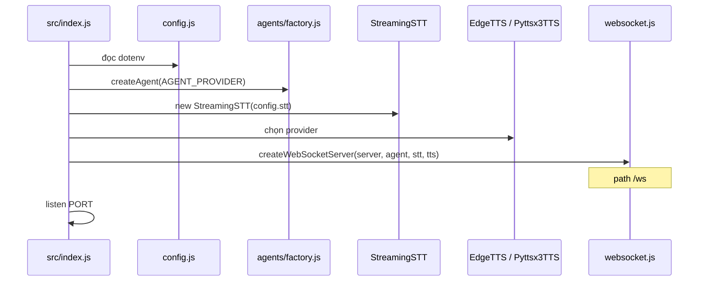
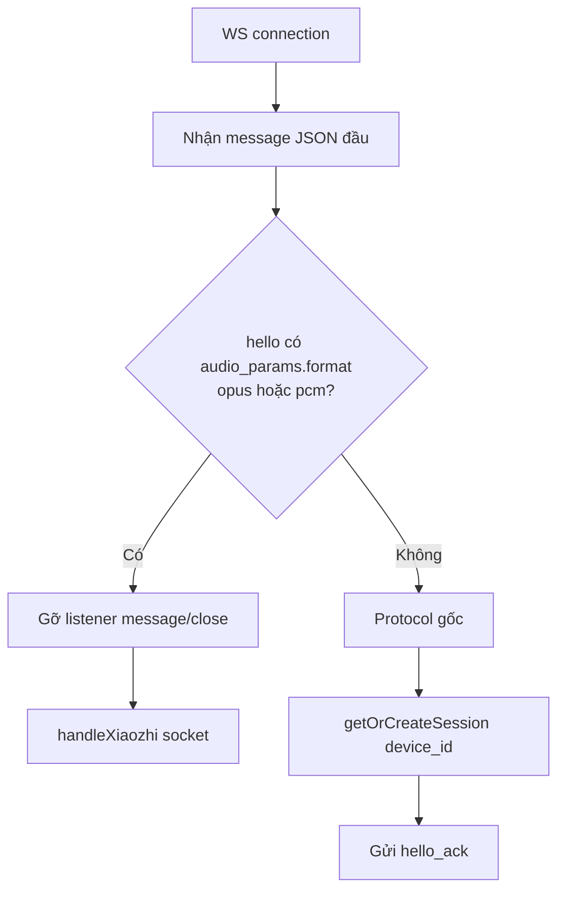
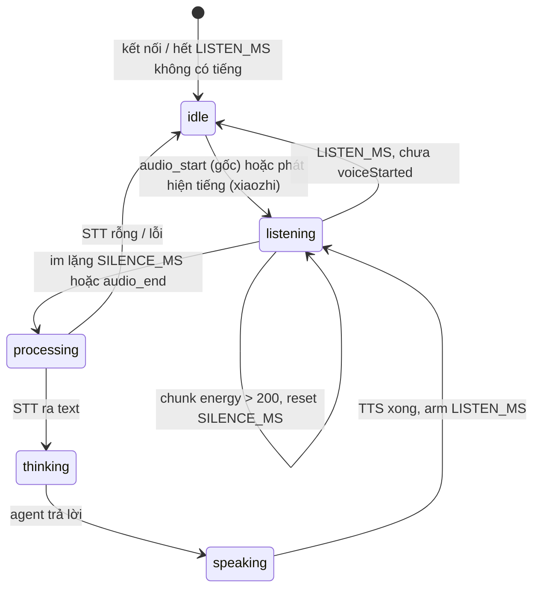
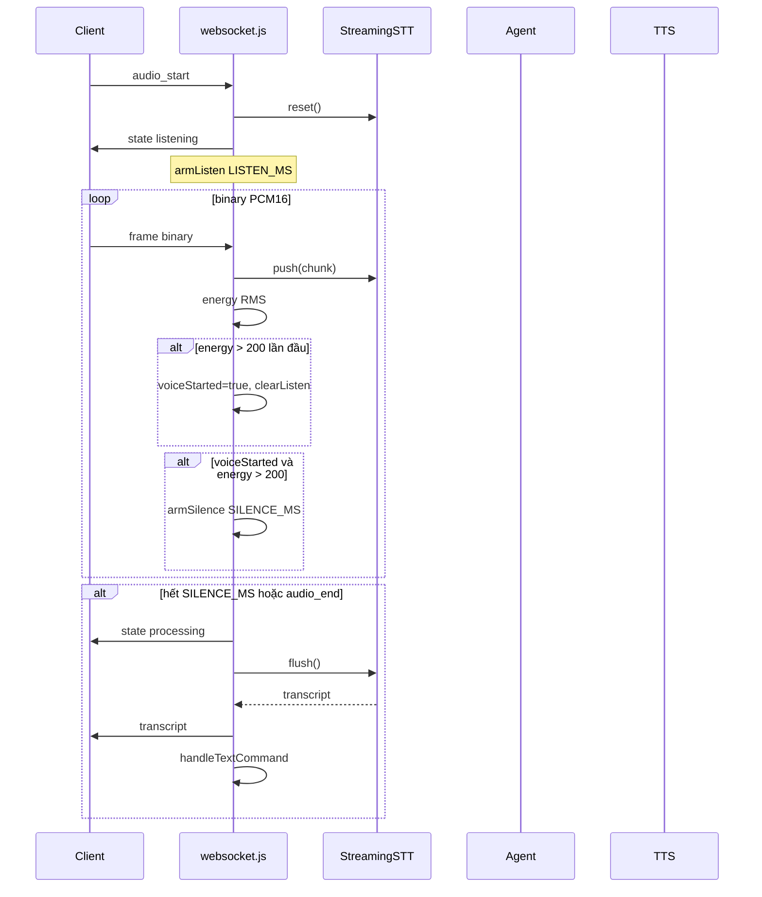
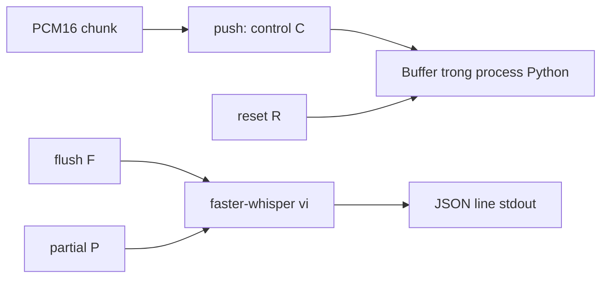

# Luồng hoạt động runtime

Tài liệu mô tả **thứ tự thực thi thật** trong code, không phải đặc tả lý tưởng. Có **hai protocol** trên cùng path `/ws`; nhánh nào chạy phụ thuộc message `hello` đầu tiên.

## 1. Khởi động process



Worker Whisper **chưa** spawn lúc start. `StreamingSTT._ensure()` chỉ chạy khi có `push` / `flush` / `reset` / `partial`.

Trang web: Express phục vụ `public/`. Firmware không dùng HTTP ngoài WS.

---

## 2. Handshake: chọn protocol

Mọi client kết nối `ws://host:PORT/ws`. Handler mặc định là `createWebSocketServer` trong `websocket.js`.



| Client | `hello` | Handler |
|--------|---------|---------|
| Firmware xiaozhi-esp32 | `audio_params.format: "opus"` | `xiaozhi.js` |
| Test bench `public/index.html` | `audio_params.format: "pcm"` | `xiaozhi.js` |
| Client protocol gốc / `ESP32_INTEGRATION.md` | `device_id`, **không** format opus/pcm | `websocket.js` |

Sau khi chuyển xiaozhi, socket **không** còn xử lý `audio_start` / `audio_end` / `interrupt` / `hello_ack` của protocol gốc.

---

## 3. Máy trạng thái hội thoại

Cùng vòng đời cho cả hai protocol (tên message hơi khác).



Giá trị:

- `VOICE_ENERGY = 200` (RMS Int16)
- `SILENCE_MS` mặc định 1200 (gốc: env; xiaozhi: hằng số)
- `LISTEN_MS` mặc định 30000 (tương tự)

Chunk **im** (energy ≤ 200) **không** reset timer im lặng — nếu reset, câu không bao giờ tự cắt.

---

## 4. Protocol gốc (`websocket.js`)

Dùng khi `hello` **không** mang `audio_params.format` opus/pcm.

### 4.1 Đăng ký session

Client:

```json
{ "type": "hello", "device_id": "esp32-001", "token": "test" }
```

Server: `hello_ack` + `session_id`. Khi `REQUIRE_DEVICE_TOKEN=true`, client remote phải gửi `token` trùng `DEVICE_TOKEN_SECRET` (loopback được miễn). Sai/thiếu → `AUTH_INVALID` / `AUTH_REQUIRED` rồi đóng socket.

### 4.2 Luồng mic → trả lời



`handleTextCommand`:

1. Lệnh cục bộ (regex âm lượng / mute) → `idle` + `agent_message`, **không** gọi LLM.
2. `state thinking` → `agent.sendMessage({ sessionId, text })`.
3. `state speaking` + `agent_message`.
4. Nếu TTS `edge-tts` hoặc `pyttsx3`: `synthesize` → `audio_start` + **một** frame binary (mp3 hoặc wav) + `audio_end`.
5. `state listening` + `armListen()` — vòng hội thoại; hết `LISTEN_MS` không tiếng → `idle`.

`interrupt`: hủy timer, `stt.reset()`, về `listening` + `armListen`.

`text`: bỏ STT, gọi thẳng `handleTextCommand` (cần đã `hello`).

### 4.3 Partial STT (tùy chọn)

`PARTIAL_ENABLED=true`: khi đang nói, mỗi 1.5s gọi `stt.partial()` → `transcript_partial`. Tốn CPU vì Whisper chạy trên buffer chưa cắt.

---

## 5. Protocol xiaozhi (`xiaozhi.js`)

Kích hoạt ngay khi hello có `format` opus hoặc pcm. Handler **tự gửi** hello server + `idle` (không đợi `audio_start`).

`deviceId` tạo random `xiaozhi-xxxxxx` — **không** lấy `device_id` từ client.

### 5.1 Codec

| `audio_params.format` | Binary lên | Binary xuống (TTS) |
|----------------------|------------|---------------------|
| `opus` | Packet Opus → `OpusDecodeStream` → PCM | WAV TTS bỏ 44 byte header → `OpusEncodeStream` từng frame 60ms |
| `pcm` | PCM16 16k đưa thẳng STT | `audio_start` format wav + một blob WAV + `audio_end` |

Hello sau đó có thể đổi `codec` nếu client gửi lại `audio_params.format`.

### 5.2 Mic liên tục (không cần audio_start)

Firmware/web gửi binary liên tục. Server:

1. Decode Opus nếu cần.
2. `stt.push(pcm)`.
3. Energy > 200 lần đầu → `voiceStarted`, `state: listening`.
4. Im lặng 1.2s → `finalizeAudio`.

Không có `audio_end` / `interrupt` trên nhánh này.

### 5.3 Message JSON khác protocol gốc

| Hướng | Type | Ý nghĩa |
|-------|------|---------|
| ↓ | `hello` | Server hello: `session_id`, `audio_params.sample_rate=16000`, `frame_duration=60` |
| ↓ | `idle` | Không có object `state` — `{ type: "idle" }` |
| ↓ | `state` | `processing` / `thinking` / `speaking` / `listening` |
| ↓ | `stt` | Text cuối câu (`transcript` bên gốc) |
| ↓ | `llm` | Trả lời agent (`agent_message` bên gốc) |
| ↓ | `tts` | `state: start\|stop` khi codec opus |
| ↓ | `audio_start` / `audio_end` | Khi codec pcm (web) |
| ↑ | `text` | Gửi text, bỏ mic |

Test bench (`public/index.html`) nghe `stt` / `llm` / `audio_end` — đúng xiaozhi, không phải `transcript` / `agent_message`.

---

## 6. Pipeline STT (`StreamingSTT` + `whisper_stream.py`)



- Model load một lần (`WHISPER_MODEL`, CPU int8).
- `F`: transcribe rồi **xóa** buffer; `P`: transcribe **giữ** buffer.
- Node xếp hàng Promise FIFO khớp từng dòng JSON (tránh đua `P` và `F`).
- Timeout request 45s → `null` (text rỗng).
- `STT_PROVIDER !== whisper` thì `flush`/`partial` trả `""`.

`STTManager` + `whisper_stt.py` (spawn mỗi file WAV) **không** nằm trên đường WS hiện tại; chỉ còn trong class cũ.

---

## 7. Pipeline TTS

Chỉ chạy nếu `TTS_PROVIDER` là `edge-tts` hoặc `pyttsx3`. `none` → client chỉ nhận text (`agent_message` / `llm`).

| Provider | Process | Output | Protocol gốc gửi | Xiaozhi opus | Xiaozhi pcm |
|----------|---------|--------|------------------|--------------|-------------|
| pyttsx3 | Python `-c` save WAV | WAV PCM | binary WAV | Opus packets | binary WAV |
| edge-tts | `python -m edge_tts` | MP3 | binary MP3 | **cắt header WAV trên MP3 — sai** | `audio_start` wav + MP3 |

Luồng hội thoại sau TTS luôn về `listening` + `armListen`, kể cả TTS lỗi (chỉ log).

---

## 8. Hai flow trên trang test

Cả hai dùng **xiaozhi + format pcm**.

**Flow 1 — Audio**

1. Mở WS, gửi hello pcm.
2. `getUserMedia` → ScriptProcessor 4096 → resample về 16 kHz Int16 → `ws.send(pcm.buffer)`.
3. Server VAD + STT + agent + TTS WAV.
4. Client gom binary giữa `audio_start` và `audio_end`, phát blob WAV.

**Flow 2 — Text**

1. Hello pcm rồi `{ type: "text", text }`.
2. Bỏ STT; agent + TTS như trên.

---

## 9. Ngắt kết nối

`close` trên cả hai handler: hủy timer silence/listen, `stt.reset()` (gửi `R` cho Whisper). Session Map **không** xóa — `deviceId` cũ vẫn còn nếu reconnect cùng id (protocol gốc). Xiaozhi mỗi connect tạo `deviceId` mới.

---

## 10. Tóm tắt điểm phân nhánh quan trọng

1. **Hello format** quyết định file handler (`websocket.js` vs `xiaozhi.js`).
2. **Energy > 200** quyết định bắt đầu câu và reset silence timer.
3. **`STT_PROVIDER=whisper`** quyết định có transcript hay chuỗi rỗng → idle.
4. **`TTS_PROVIDER`** quyết định có binary audio hay chỉ text.
5. **`AGENT_PROVIDER`** quyết định echo local hay HTTP backend.
6. Regex âm lượng **chỉ** protocol gốc; xiaozhi luôn gửi text vào agent.
